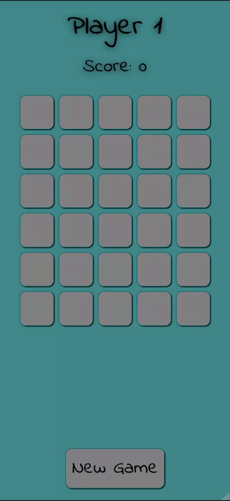

# Memory Game App
This project is a simple memory game app based on React Native technology.
## Setup
TODO with Lucian
## How To Play
The app displays 30 cards in a 5×6 grid (width × height). Each card occurs twice; 15 different motifs are needed. The game is played by 2 players where each player can reveal 2 cards in turn. If the two cards are not the same (different motifs), the non-matching cards will be covered again and it is the next player's turn. If the cards match (identical motif), the player gets a point, the matching cards disappear and the same player can reveal two cards again. The game ends when all the cards disappear. A new game can be started by pressing on the "New Game" button. the cards are reshuffled and displayed face down again.

